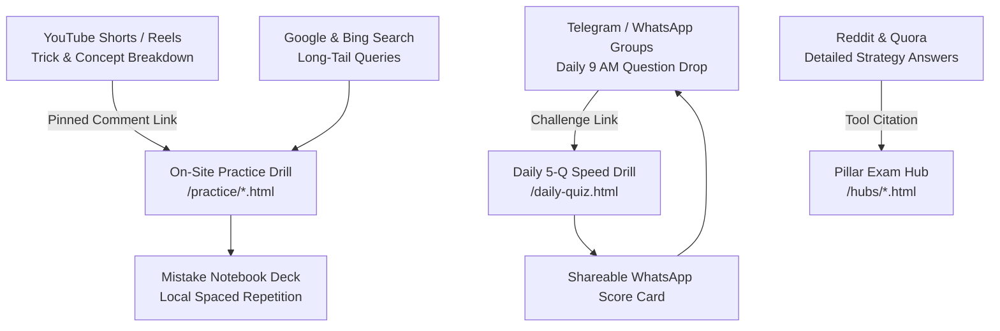

# PrepSelf Multi-Channel Organic Distribution & Community Playbook

> **Platform:** [PrepSelf (prepself.in)](https://prepself.in/)  
> **Mission:** 100% Free, open-access competitive exam self-study platform for 80+ Indian competitive exams.  
> **Target Audience:** SBI PO, IBPS Clerk, SSC CGL/CHSL, UPSC CSE, Railways RRB NTPC, and UP State Recruitment aspirants.

---

## 1. Executive Strategy & Distribution Flywheel

To grow organically without ad spend, PrepSelf deploys a **Value-First Discovery Loop**:
1. **Search & AI Engines:** Programmatic topic pages (`/practice/*.html`) and pillar guides (`/hubs/*.html`) indexed via Google Search Console and Bing IndexNow.
2. **Short-Form Video (YouTube Shorts & Instagram Reels):** 60-second pedagogical shortcuts that solve high-anxiety problems (e.g. Quadratic equations, Syllogisms) with pinned comments driving traffic to on-site interactive drills.
3. **Daily Aspirant Channels (Telegram & WhatsApp):** Fixed-time 9:00 AM daily question drops and shareable quiz result badges that encourage peer challenges.
4. **Community Forums (Reddit & Quora):** High-density answers that solve specific exam strategy queries, citing PrepSelf calculators and free libraries as open reference tools.



---

## 2. YouTube Shorts Production Scripts (Ready to Record)

### Script 1: "Solve 5 Quadratic Equations in 60 Seconds (SBI PO / IBPS)"
* **Hook (0:00–0:07):** *(Pointing at equation on whiteboard)* "If you're still using \( -b \pm \sqrt{b^2 - 4ac} \) in bank prelims, you're literally giving away 5 free marks to your competitors. Watch this."
* **Concept Breakdown (0:07–0:32):**  
  "Look at Equation 1: \( x^2 + 5x - 24 = 0 \). Look at Equation 2: \( y^2 - 3y - 28 = 0 \).  
  Rule number one: Look directly at the constant term. Both constants are NEGATIVE (\(-24\) and \(-28\)).  
  Whenever both equations have negative constants, each equation ALWAYS produces one positive root and one negative root.  
  And when positive and negative roots overlap, the answer is ALWAYS: Relationship Cannot Be Established (CND).  
  You don't calculate roots. You don't split factors. Mark CND in 2 seconds and move on."
* **Call to Action (0:32–0:45):**  
  "Want to practice 20 more sign-method questions with instant timers? Click the pinned link in the comments for our 100% free interactive practice drill on PrepSelf."
* **Pinned Comment Copy:**  
  `📌 Practice the complete 60-Second Quadratic Equation Sign Method on PrepSelf (Free, zero sign-up): https://prepself.in/practice/sbi-po-quadratic-equations.html`

---

### Script 2: "Mental Percentage Math: Never Draw Rough Work Again"
* **Hook (0:00–0:06):** "What is 37.5% of 960? If you started multiplying 37.5 by 960 in your rough sheet, STOP. Do this instead."
* **Concept Breakdown (0:06–0:35):**  
  "In banking exams, decimals are fractions in disguise.  
  12.5% is 1/8.  
  So 37.5% is just three times 12.5%, which means it's 3/8!  
  Now calculate: 3/8 of 960.  
  960 divided by 8 is 120. Multiply by 3 is 360.  
  Answer is 360 in under 4 seconds completely in your head.  
  Memorize the 1/2 to 1/20 fraction table and your Quant score in SBI Clerk will jump by 8 marks."
* **Call to Action (0:35–0:50):**  
  "I put the entire fraction-to-percentage table and a 5-question test with timer at the link pinned below. Test yourself now!"
* **Pinned Comment Copy:**  
  `📌 Free Fraction-to-Percentage Shortcut Table & Speed Test: https://prepself.in/practice/sbi-clerk-percentage-questions.html`

---

### Script 3: "The 'Only a Few' Syllogism Trap (TCS / IBPS Favorite)"
* **Hook (0:00–0:07):** "80% of banking aspirants get this single syllogism statement wrong. Let's make sure you never lose marks on it."
* **Concept Breakdown (0:07–0:34):**  
  "Statement: 'Only a few Pens are Pencils.'  
  Most students think this just means 'Some Pens are Pencils.' WRONG!  
  'Only a few' is a COMPOUND statement. It means TWO things simultaneously:  
  1. Some Pens ARE Pencils.  
  2. Some Pens are definitely NOT Pencils.  
  So if the conclusion asks: 'All Pens can be Pencils is a possibility' — it is 100% FALSE! Because that restricted portion of Pens can never enter Pencils.  
  However, can all Pencils be Pens? YES! Pencils can freely enter Pens."
* **Call to Action (0:34–0:48):**  
  "Don't lose marks on TCS traps. Test your 3-circle Venn diagram skills on our interactive quiz tool right now."
* **Pinned Comment Copy:**  
  `📌 Test your Syllogism skills on our free interactive quiz lab: https://prepself.in/practice/ibps-po-syllogism-practice.html`

---

## 3. Telegram & WhatsApp Community Channels Playbook

### Daily 9:00 AM Question Drop (Aspirant Broadcaster)
```text
🎯 PrepSelf Daily Speed Drill #DayStreak

Q: If the price of sugar increases by 25%, by what percentage must a household reduce consumption to keep total expenditure constant?

A) 16.66%
B) 20.00%
C) 25.00%
D) 18.50%

💡 Formula: [R / (100 + R)] × 100%
👉 Solve the full 5-question mixed speed drill (with timer & explanations):
https://prepself.in/daily-quiz.html

⚡ 100% Free • No Sign-In • Open-Education Initiative
```

### Monthly Current Affairs Release Broadcast
```text
📰 October 2026 Monthly Current Affairs & Banking Capsule is LIVE!

Key Highlights for SBI PO, SSC CGL & UPSC:
• RBI MPC Policy Rates & LAF Corridor Review
• Retail e-Rupee Offline NFC Protocols
• PM-Surya Ghar Scheme Financing Norms
• 15 Revision MCQs with instant answer feedback

Read the full high-yield summary (No PDF paywalls, instant web access):
👉 https://prepself.in/current-affairs-capsule.html
```

---

## 4. Reddit & Quora Community Engagement Strategy

### Target Subreddits
* `r/bankpo` (Bank PO & Clerk strategy, resource queries)
* `r/ssc` (SSC CGL, CHSL, MTS math and typing discussions)
* `r/UPSC` (Prelims CSAT, Mains Ethics case studies)
* `r/Indian_Academia` (Competitive exams vs higher ed guidance)

### Engagement Protocol
1. **Rule of 90/10:** 90% of every reply must deliver comprehensive, actionable value directly inside the comment (e.g. reproducing formulas, detailing syllabus strategies, explaining the step-by-step logic).
2. **Contextual Tool Citation:** Mention PrepSelf only as an open-source non-commercial resource where helpful (e.g. *"If you want to calculate your exact negative marking penalty or practice with a timer, I built an open tool here: prepself.in/negative-marking-calculator.html"*).
3. **No Commercial Hype:** Never use marketing adjectives like "best", "unbeatable", or "number 1". Frame it purely as open educational software built for Indian students.

---

## 5. Webmaster & Search Engine Indexing Checklist

| Step | Action | Endpoint / Tool | Status |
|:---|:---|:---|:---|
| 1 | Google Search Console verification | Add HTML meta tag or DNS TXT record for `prepself.in` | Required |
| 2 | Submit XML Sitemap to Google | Submit `https://prepself.in/sitemap.xml` | Required |
| 3 | Bing Webmaster Tools & Copilot | Import from Google Search Console | Required |
| 4 | IndexNow Instant Ping Script | Run `python scripts/ping_indexnow.py` | Configured |
| 5 | Request Priority Indexing | Submit top 15 hub & practice URLs in URL Inspection tool | Recommended |
| 6 | Track Core Web Vitals | Inspect LCP, FID, CLS on Android 4G connection | Optimized |
